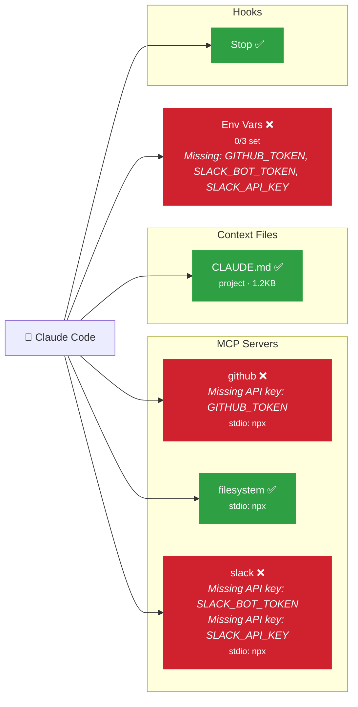

# ai-env-diagram — AI Environment Diagram

Scans your project's Claude Code / AI environment and generates a **Mermaid diagram** that visualizes all connected components and their health status.

## What it detects

| Component              | Sources scanned                                                                              |
|------------------------|----------------------------------------------------------------------------------------------|
| **Model**              | `model` field in `.claude/settings.json`, `~/.claude/settings.json`, `ANTHROPIC_MODEL` env var |
| **MCP Servers**        | `.mcp.json`, `.claude/settings.json`, `~/.claude/settings.json`                             |
| **Context Files**      | `CLAUDE.md` (project, parent dirs, home), `.claude/` directory                              |
| **Hooks**              | `PreToolUse`, `PostToolUse`, `Stop`, etc. from settings                                     |
| **Integrations**       | [MemPalace](https://www.mempalace.tech/), Caveman skill, [RTK](https://www.rtk-ai.app/)     |
| **Environment Variables** | All env vars referenced by MCP server configs                                            |

## What it reports

- **Model check**: flags a warning if no model is set, an error if the configured model is not Sonnet
- **CLAUDE.md token count**: estimates token usage per context file (~4 chars/token heuristic)
- **Status per component**: OK (green), Warning (orange), Error (red)
- **Missing API keys**: detects unset `*_API_KEY`, `*_TOKEN`, `*_SECRET` env vars
- **Unavailable commands**: checks if MCP server commands exist in `PATH`
- **Missing hook scripts**: verifies hook scripts exist and are executable (for both file paths and shell commands)
- **Integration health**:
  - **MemPalace**: checks the `mempalace` MCP server is registered and the binary is in PATH
  - **Caveman**: verifies the skill exists in `~/.claude/skills/caveman/` or `.claude/skills/caveman/` with a `SKILL.md`
  - **RTK**: detects the `rtk` binary, `RTK.md` files, and RTK hooks in settings

## Usage

```bash
# Scan the current directory
npx ai-env-diagram

# Scan a specific project
npx ai-env-diagram --path /path/to/project

# Write diagram to a file
npx ai-env-diagram --output diagram.md

# Include a summary table with errors/warnings
npx ai-env-diagram --summary
```

## Example output

Running `ai-env-diagram` on a project with GitHub, Filesystem, and Slack MCP servers (where Slack is missing its API tokens):



## Getting Started

```bash
# Clone the repo
git clone https://github.com/clementbrunel/my-ai-tools.git
cd my-ai-tools/ai-env-diagram

# Install dependencies
npm install

# Build
npm run build

# Run
node dist/index.js --path /your/project
```

## Project Structure

```
src/
  index.ts              — CLI entrypoint
  types.ts              — Shared type definitions
  scanner/
    model.ts            — Model check (verifies Sonnet is configured)
    mcp.ts              — MCP server detection & validation
    context.ts          — Context file detection + token estimation
    hooks.ts            — Hooks configuration scanning
    integrations.ts     — MemPalace, Caveman, RTK detection
    env.ts              — Environment variable checking
  diagram/
    mermaid.ts          — Mermaid diagram generation
```

## License

MIT
