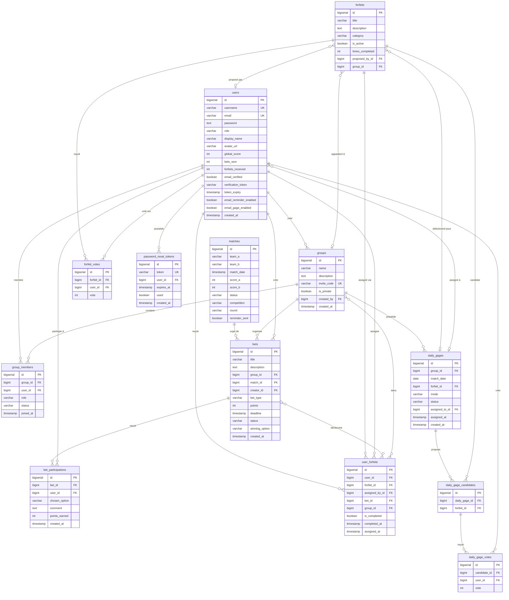

# Modèle de données — Prono Core

## Diagramme Entité-Relation

---

## Tables et descriptions

### `users` — Utilisateurs

Compte joueur sur la plateforme.

| Colonne | Type | Description |
|---------|------|-------------|
| `id` | BIGSERIAL PK | Identifiant unique |
| `username` | VARCHAR(50) UNIQUE | Nom d'utilisateur |
| `email` | VARCHAR(100) UNIQUE | Adresse e-mail |
| `password` | TEXT | Hash BCrypt |
| `role` | VARCHAR(20) | `PLATFORM_ADMIN` ou `USER` |
| `display_name` | VARCHAR(100) | Nom affiché (optionnel) |
| `avatar_url` | VARCHAR(255) | URL de l'avatar |
| `global_score` | INT | Score cumulé toutes compétitions |
| `bets_won` | INT | Nombre de paris gagnés |
| `forfeits_received` | INT | Nombre de gages reçus |
| `email_verified` | BOOLEAN | Vérification e-mail effectuée |
| `verification_token` | VARCHAR(255) | Token de vérification e-mail |
| `token_expiry` | TIMESTAMP | Expiration du token de vérification |
| `email_reminder_enabled` | BOOLEAN | Rappels par e-mail activés |
| `email_gage_enabled` | BOOLEAN | Notifications de gage par e-mail |
| `created_at` | TIMESTAMP | Date de création |

---

### `groups` — Groupes de jeu

Groupe d'amis partageant des paris et des gages.

| Colonne | Type | Description |
|---------|------|-------------|
| `id` | BIGSERIAL PK | Identifiant unique |
| `name` | VARCHAR(100) | Nom du groupe |
| `description` | TEXT | Description (optionnel) |
| `invite_code` | VARCHAR(20) UNIQUE | Code d'invitation |
| `is_private` | BOOLEAN | Groupe privé (sur invitation) |
| `created_by` | BIGINT FK → users | Créateur du groupe |
| `created_at` | TIMESTAMP | Date de création |

---

### `group_members` — Membres de groupe

Table de jonction entre utilisateurs et groupes.

| Colonne | Type | Description |
|---------|------|-------------|
| `id` | BIGSERIAL PK | Identifiant unique |
| `group_id` | BIGINT FK → groups | Groupe |
| `user_id` | BIGINT FK → users | Utilisateur |
| `role` | VARCHAR(20) | `GROUP_ADMIN` ou `MEMBER` |
| `status` | VARCHAR(20) | `ACTIVE` ou `PENDING` |
| `joined_at` | TIMESTAMP | Date d'adhésion |

Contrainte unique : `(group_id, user_id)`

---

### `matches` — Matchs

Rencontres sportives (Coupe du Monde 2026).

| Colonne | Type | Description |
|---------|------|-------------|
| `id` | BIGSERIAL PK | Identifiant unique |
| `team_a` | VARCHAR(100) | Équipe domicile |
| `team_b` | VARCHAR(100) | Équipe extérieur |
| `match_date` | TIMESTAMP | Date et heure du match |
| `score_a` | INT | Score équipe A (null avant résultat) |
| `score_b` | INT | Score équipe B (null avant résultat) |
| `status` | VARCHAR(20) | `UPCOMING`, `ONGOING`, `FINISHED` |
| `competition` | VARCHAR(100) | Nom de la compétition |
| `round` | VARCHAR(100) | Tour (phase de groupes, etc.) |
| `reminder_sent` | BOOLEAN | Rappel e-mail envoyé |

---

### `bets` — Paris

Pari associé à un match et un groupe.

| Colonne | Type | Description |
|---------|------|-------------|
| `id` | BIGSERIAL PK | Identifiant unique |
| `title` | VARCHAR(200) | Intitulé du pari |
| `description` | TEXT | Détails (optionnel) |
| `group_id` | BIGINT FK → groups | Groupe concerné |
| `match_id` | BIGINT FK → matches | Match concerné (optionnel) |
| `creator_id` | BIGINT FK → users | Créateur du pari |
| `bet_type` | VARCHAR(20) | `SCORE`, `EVENT`, `FORFEIT`, `FREE` |
| `points` | INT | Mise en points |
| `deadline` | TIMESTAMP | Date limite pour parier |
| `status` | VARCHAR(20) | `OPEN`, `VALIDATED`, `CANCELLED` |
| `winning_option` | VARCHAR(200) | Option gagnante (après validation) |
| `created_at` | TIMESTAMP | Date de création |

Contrainte unique : `(match_id, group_id)` — un seul pari par match par groupe.

---

### `bet_participations` — Participations aux paris

Pronostic d'un joueur sur un pari.

| Colonne | Type | Description |
|---------|------|-------------|
| `id` | BIGSERIAL PK | Identifiant unique |
| `bet_id` | BIGINT FK → bets | Pari concerné (CASCADE DELETE) |
| `user_id` | BIGINT FK → users | Joueur |
| `chosen_option` | VARCHAR(200) | Option choisie |
| `comment` | TEXT | Commentaire (optionnel) |
| `points_earned` | INT | Points gagnés après validation |
| `created_at` | TIMESTAMP | Date de participation |

Contrainte unique : `(bet_id, user_id)`

---

### `forfeits` — Gages

Gage pouvant être assigné aux perdants. Partagé (global) ou privé (par groupe).

| Colonne | Type | Description |
|---------|------|-------------|
| `id` | BIGSERIAL PK | Identifiant unique |
| `title` | VARCHAR(200) | Intitulé du gage |
| `description` | TEXT | Description |
| `category` | VARCHAR(100) | Catégorie (ex: General) |
| `is_active` | BOOLEAN | Gage disponible pour assignation |
| `times_completed` | INT | Nombre de fois accompli |
| `proposed_by_id` | BIGINT FK → users | Proposé par (null = créé par admin) |
| `group_id` | BIGINT FK → groups | Groupe propriétaire (null = partagé) |

---

### `forfeit_votes` — Votes sur les gages

Vote d'approbation / rejet d'un gage par un joueur.

| Colonne | Type | Description |
|---------|------|-------------|
| `id` | BIGSERIAL PK | Identifiant unique |
| `forfeit_id` | BIGINT FK → forfeits | Gage voté (CASCADE DELETE) |
| `user_id` | BIGINT FK → users | Votant (CASCADE DELETE) |
| `vote` | INT | `+1` (pour) ou `-1` (contre) |

Contrainte unique : `(forfeit_id, user_id)`

---

### `user_forfeits` — Gages assignés

Association entre un joueur et un gage qui lui a été attribué.

| Colonne | Type | Description |
|---------|------|-------------|
| `id` | BIGSERIAL PK | Identifiant unique |
| `user_id` | BIGINT FK → users | Joueur qui reçoit le gage |
| `forfeit_id` | BIGINT FK → forfeits | Gage concerné |
| `assigned_by_id` | BIGINT FK → users | Joueur qui assigne le gage |
| `bet_id` | BIGINT FK → bets | Pari déclencheur (optionnel) |
| `group_id` | BIGINT FK → groups | Groupe concerné (optionnel) |
| `is_completed` | BOOLEAN | Gage accompli |
| `completed_at` | TIMESTAMP | Date d'accomplissement |
| `assigned_at` | TIMESTAMP | Date d'assignation |

---

### `daily_gages` — Gages du jour

Gage quotidien attribué au perdant du jour dans un groupe.

| Colonne | Type | Description |
|---------|------|-------------|
| `id` | BIGSERIAL PK | Identifiant unique |
| `group_id` | BIGINT FK → groups | Groupe concerné |
| `match_date` | DATE | Date du jour |
| `forfeit_id` | BIGINT FK → forfeits | Gage sélectionné (null jusqu'à sélection) |
| `mode` | VARCHAR(20) | `DIRECT` (admin choisit) ou `VOTE` (vote du groupe) |
| `status` | VARCHAR(20) | `PENDING`, `ACTIVE`, `SETTLED` |
| `assigned_to_id` | BIGINT FK → users | Joueur perdant du jour |
| `assigned_at` | TIMESTAMP | Date d'assignation |
| `created_at` | TIMESTAMP | Date de création |

Contrainte unique : `(group_id, match_date)` — un seul gage par jour par groupe.

---

### `daily_gage_candidates` — Candidats au gage du jour

Gages en lice lors d'un vote pour le gage du jour.

| Colonne | Type | Description |
|---------|------|-------------|
| `id` | BIGSERIAL PK | Identifiant unique |
| `daily_gage_id` | BIGINT FK → daily_gages | Gage du jour concerné (CASCADE DELETE) |
| `forfeit_id` | BIGINT FK → forfeits | Gage candidat |

Contrainte unique : `(daily_gage_id, forfeit_id)`

---

### `daily_gage_votes` — Votes pour le gage du jour

Vote d'un joueur pour un candidat au gage du jour.

| Colonne | Type | Description |
|---------|------|-------------|
| `id` | BIGSERIAL PK | Identifiant unique |
| `candidate_id` | BIGINT FK → daily_gage_candidates | Candidat voté (CASCADE DELETE) |
| `user_id` | BIGINT FK → users | Votant |
| `vote` | INT | `+1` (pour) ou `-1` (contre) |

Contrainte unique : `(candidate_id, user_id)`

---

### `password_reset_tokens` — Tokens de réinitialisation

Tokens à usage unique pour la réinitialisation de mot de passe.

| Colonne | Type | Description |
|---------|------|-------------|
| `id` | BIGSERIAL PK | Identifiant unique |
| `token` | VARCHAR(36) UNIQUE | Token UUID |
| `user_id` | BIGINT FK → users | Utilisateur concerné (CASCADE DELETE) |
| `expires_at` | TIMESTAMP | Date d'expiration |
| `used` | BOOLEAN | Token déjà utilisé |
| `created_at` | TIMESTAMP | Date de création |

---

## Énumérations

| Enum | Valeurs | Utilisé dans |
|------|---------|--------------|
| `UserRole` | `PLATFORM_ADMIN`, `USER` | `users.role` |
| `GroupMemberRole` | `GROUP_ADMIN`, `MEMBER` | `group_members.role` |
| `GroupMemberStatus` | `ACTIVE`, `PENDING` | `group_members.status` |
| `MatchStatus` | `UPCOMING`, `ONGOING`, `FINISHED` | `matches.status` |
| `BetType` | `SCORE`, `EVENT`, `FORFEIT`, `FREE` | `bets.bet_type` |
| `BetStatus` | `OPEN`, `VALIDATED`, `CANCELLED` | `bets.status` |
| `DailyGageMode` | `DIRECT`, `VOTE` | `daily_gages.mode` |
| `DailyGageStatus` | `PENDING`, `ACTIVE`, `SETTLED` | `daily_gages.status` |

---

## Évolution du schéma (Flyway)

Les migrations sont dans `backend/src/main/resources/db/migration/`.

| Version | Description |
|---------|-------------|
| V1 | Schéma initial : `users`, `matches`, `bets`, `bet_participations`, `forfeits`, `user_forfeits` |
| V2–V8 | Données de démo, correctifs, attachement des gages aux matchs, contrainte un-pari-par-match |
| V9 | Système de gage quotidien : `daily_gages`, `daily_gage_candidates`, `daily_gage_votes` |
| V12–V15 | Gestion des groupes : `groups`, `group_members`, confidentialité, statut des membres |
| V16–V19 | Portée par groupe : paris, gages et gages quotidiens liés aux groupes |
| V21–V29 | Améliorations utilisateur : `display_name`, vérification e-mail, `password_reset_tokens`, rappels e-mail, préférences gage |
