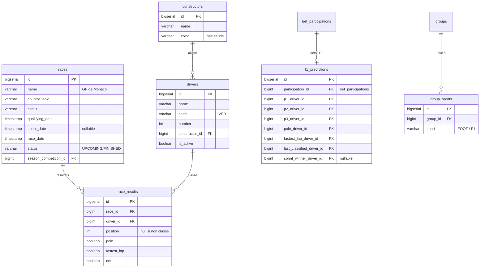

# Proposition — Pronostics Formule 1 🏎

> **Décisions validées le 11/07/2026** : formule A « Podium + » · lanterne rouge
> (dernier classé) · double deadline (pole aux qualifs, le reste à la course) ·
> mini-F1 pour le drag & drop · pas de paris sur les sprints mais leurs
> points comptent au championnat · import jolpica implémenté (bouton admin)
> avec saisie manuelle en secours. Phases 1 à 3 implémentées.
> État des lieux : le thème F1, le `SportContext` et les 3 écrans WIP (`F1Dashboard`, `F1Races`, `F1Bets`) existent déjà côté frontend. Rien côté backend.

---

## 1. Philosophie

Même esprit que le foot : **pas d'argent, du fun, des gages**. Un Grand Prix est un événement plus rare qu'un match de foot (24 GP / an vs. plusieurs matchs par jour en Coupe du Monde), donc un GP peut « peser » plus lourd qu'un match — environ 2 à 3 matchs de foot en points max.

Règle d'or côté saisie : **jamais plus de ~6 choix par GP**. Classer les 20 pilotes à chaque course est éliminé d'office : c'est fastidieux, ça tue le fun, et personne ne le fera 24 fois dans la saison.

---

## 2. Barème — 3 formules proposées

### Formule A — « Podium + » ⭐ (recommandée)

Le prono d'un GP = **6 picks**, saisis par drag & drop :

| Pick | Points | Verrouillage |
|---|:---:|---|
| 🥇🥈🥉 Podium dans l'ordre (P1, P2, P3) | 3 + 2 + 2 si position exacte, **1** si le pilote est sur le podium mais à la mauvaise place | Départ de la course |
| ⏱ Pole position (top qualif) | **2** | Début des qualifs |
| 🟣 Meilleur tour en course | **1** | Départ de la course |
| 🔦 Lanterne rouge (dernier pilote **classé** à l'arrivée) | **2** | Départ de la course |
| 👑 Bonus « Grand Chelem » : pole + P1 + meilleur tour tous corrects | **+2** | — |

- **Maximum : 14 points** par GP (7 podium + 2 pole + 1 meilleur tour + 2 lanterne rouge + 2 chelem).
- Le scoring est **additif**, exactement comme le foot (chaque élément correct rapporte indépendamment).
- La **lanterne rouge** est le pick « fun » : imprévisible, tout le monde peut marquer, et ça fait suivre le fond de grille. (Variante possible : « premier abandon » — plus cruel, mais problème quand il n'y a aucun abandon.)
- Deux deadlines : la pole se joue **avant les qualifs**, le reste **avant la course**. Entre les deux on peut ajuster son podium en connaissant la grille — c'est voulu, ça fait revenir les gens deux fois dans le week-end.

### Formule B — « Top 5 à l'écart »

Classer ses 5 premiers pilotes ; chaque pilote rapporte `max(0, 3 − |position prédite − position réelle|)` → max 15 pts. Simple à comprendre, tolérant (un pilote décalé d'une place rapporte encore 2 pts), mais moins « typé F1 » (pas de pole, pas de meilleur tour) et la saisie est un cran plus longue.

### Formule C — « Classement complet dans les points » (top 10)

Rejetée : 10 picks ordonnés par course, saisie trop lourde, écarts de points énormes entre joueurs assidus et occasionnels. On garde l'idée pour des **événements spéciaux** (ex. dernier GP de la saison, points doublés, top 10 complet).

### Week-ends Sprint

Mini-prono optionnel : **vainqueur du sprint = 2 pts**, verrouillé au départ du sprint. Un seul pick, saisi depuis la même carte de GP.

### Paris de saison (bonus fun, phase 2)

Avant le 1er GP (ou à mi-saison) : champion pilotes, champion constructeurs, premier pilote viré 😈… Ces paris passent par le système **générique existant** (`bets` de type `EVENT`/`FREE` avec deadline) — zéro développement backend.

---

## 3. Saisie — drag & drop « paddock »

L'écran de prono d'un GP :

```
┌──────────────────────────────────────────────┐
│  🏁 GP de Monaco — 24 mai · qualif dans 2j   │
├──────────────────────────────────────────────┤
│            ┌────┐                            │
│   ┌────┐   │ P1 │   ┌────┐    ⏱ POLE  [ __ ] │
│   │ P2 │   │    │   │ P3 │    🟣 M.TOUR[ __ ] │
│   └────┘   └────┘   └────┘    🔦 DERNIER[ __ ]│
├──────────────────────────────────────────────┤
│  PADDOCK (20 pilotes, couleurs écurie)       │
│  🏎VER 🏎NOR 🏎LEC 🏎HAM 🏎PIA 🏎RUS 🏎ALO …  │
└──────────────────────────────────────────────┘
```

- **Paddock** : 20 mini-F1 (ou casques) en SVG teintés aux **couleurs de l'écurie**, avec le code 3 lettres et le numéro du pilote (`VER · 1`). Un seul SVG paramétré par une couleur `constructor.color` — pas d'assets à licencier, pas d'images à maintenir.
- On **glisse** une voiture sur un slot (P1 surélevé au centre, podium style marches). Déposer sur un slot occupé **échange** les deux pilotes. Un pilote déjà placé apparaît grisé dans le paddock.
- Le slot « meilleur tour » est **violet** (code couleur F1 universel), la lanterne rouge a un fond damier grisé.
- **Mobile d'abord** : le drag & drop tactile est fragile, donc fallback **tap-tap** natif (on tape le slot → le paddock passe en mode sélection → on tape le pilote). Librairie : `dnd-kit` (léger, tactile, accessible, React 18).
- Micro-célébration à la validation (confetti / vibration) — même ADN que le reste de l'app.
- Après la course, le même écran devient l'écran de **résultat** : les slots corrects s'allument en vert, les points gagnés s'affichent par pick.

---

## 4. Frontière commun / spécifique F1

C'est le point structurant. Proposition : **le pipeline de points reste commun, le domaine course devient spécifique.**

### Partagé (réutilisé tel quel)

| Brique | Pourquoi ça marche sans changement |
|---|---|
| `users`, `groups`, `group_members`, auth JWT | Aucun lien au sport |
| `bets` + `bet_participations` (`points_earned`) | C'est **le** pipeline : classement, gage du jour, forfeits, stats — tout en découle. On le garde comme colonne vertébrale. |
| Forfeits / gages (globaux, groupe, quotidiens) | Un perdant est un perdant ⚽=🏎 |
| `LeaderboardService`, dashboard, e-mails de rappel | Fonctionnent sur `bets`/`points_earned`, il suffit de les nourrir |
| Frontend : `SportContext`, thèmes, Navbar, Leaderboard, composants génériques | Déjà prêts |

### Spécifique F1 (nouveau, sans toucher au foot)

| Brique | Contenu |
|---|---|
| `constructors` | nom, couleur (hex) |
| `drivers` | nom, code 3 lettres, numéro, FK constructeur |
| `races` | GP, pays/circuit, date qualif, date sprint (nullable), date course, statut |
| `race_results` | classement complet saisi/importé : (race, driver, position, pole?, fastest_lap?, dnf?) |
| `f1_predictions` | le **payload structuré** du prono (voir §5) |
| `F1RaceService` | ouverture des paris, calcul des points formule A, settlement |
| Écrans : saisie drag & drop, calendrier, standings | Sur la base des WIP existants |

### Ce qu'on ne fait PAS

- **On ne range pas un GP dans `matches`** : `team_a`/`team_b`/`score_a`/`score_b` n'ont aucun sens pour une course ; les colonnes nullable en cascade pourriraient l'entité. Une course est une entité à part.
- **On ne duplique pas le pipeline de points** : pas de `f1_leaderboard`, pas de `f1_forfeits`.

### L'astuce de couture

`bets` reçoit une colonne **`race_id` nullable** (comme `match_id` l'est déjà) + un `bet_type = RACE_PICKS`. Un pari F1 est donc un `bet` ordinaire du point de vue du groupe, du classement et des gages :

- L'admin de groupe « ouvre » un GP → un `bet(race_id, group_id)` est créé (même flux que `openMatchForBetting`).
- Le joueur pronostique → une `bet_participation` ordinaire est créée, et le détail (P1/P2/P3/pole/…) part dans `f1_predictions` liée à la participation. `chosen_option` garde un résumé lisible (`"VER · NOR · LEC | pole VER | mt HAM | der BOT"`) pour l'historique et les écrans existants.
- L'admin valide les résultats → `F1RaceService` calcule les points et écrit `points_earned` → **classement, gage du jour, forfaits fonctionnent sans une ligne de code en plus**.

Contrainte à ajouter : un `bet` référence `match_id` **ou** `race_id`, jamais les deux (CHECK SQL), et unicité `(race_id, group_id)` comme pour les matchs.

---

## 5. Modèle de données (delta)



Et côté existant : `competitions.sport` (`FOOT`/`F1`, défaut `FOOT`) pour porter la saison (« F1 2026 »), `bets.race_id` nullable.

---

## 6. Classements pilotes & constructeurs

Affichage demandé : deux onglets sur une page « Standings » F1 (pilotes / constructeurs), lignes aux couleurs écurie, écarts de points, flèches d'évolution depuis le dernier GP.

**Aucune table de classement** : les standings se **calculent** depuis `race_results` avec le barème FIA (25-18-15-12-10-8-6-4-2-1, sprint 8→1). Constructeurs = somme des deux pilotes. Comme ça, dès que l'admin saisit un résultat de course, les standings sont à jour — une seule source de vérité.

**Saisie des résultats** — deux phases :

- **Phase 1 (manuel)** : écran admin avec le même drag & drop que les joueurs, mais 20 slots. C'est la partie la plus fastidieuse du manuel (~2 min par GP), acceptable pour démarrer.
- **Phase 2 (import auto)** : sync depuis l'API publique **jolpica-f1** (successeur d'Ergast, gratuit) via un job Spring `@Scheduled` le dimanche soir : résultats importés → paris **auto-settlés** → e-mails de résultat. L'admin ne fait plus rien. (openf1.org en alternative temps réel.)

Je recommande de construire la phase 1 avec l'import en tête (le format de `race_results` colle au format jolpica) pour que la phase 2 soit un simple connecteur.

---

## 7. Groupes multi-sports

- Table `group_sports(group_id, sport)` — un groupe coche ⚽, 🏎 ou les deux à la création (modifiable par l'admin de groupe ensuite).
- Migration : tous les groupes existants reçoivent `FOOT`.
- **Effets** : un GP ne peut être ouvert que dans un groupe F1 ; la navbar ne propose l'univers 🏎 que si l'un de vos groupes joue à la F1 ; l'écran « ouvrir les paris » filtre par sport.
- **Classements** : un classement **par sport** dans chaque groupe (filtre sur `bets.match_id` vs `bets.race_id`), plus l'onglet « Général » combiné qui existe déjà de fait (somme de `points_earned`). Le barème A (max 14/GP vs max 5-7/match) reste comparable en volume sur une saison, donc le combiné garde du sens.

---

## 8. Phasage proposé

| Phase | Contenu | Valeur |
|---|---|---|
| **1** | Migrations (constructors, drivers, races, race_results, f1_predictions, group_sports, bets.race_id) + seed saison 2026 + `F1RaceService` (ouverture, scoring A, settlement) + admin manuel | Le moteur tourne |
| **2** | Écran drag & drop paddock (dnd-kit, tap-tap mobile) + calendrier des GP + écran résultat de prono | L'expérience fun |
| **3** | Standings pilotes/constructeurs + rattachement groupes↔sports dans l'UI | Le demandé complet |
| **4** | Import jolpica auto-settlement + sprint + paris de saison + bonus Grand Chelem animé | Le confort |

---

## 9. Questions à trancher ensemble

1. **Barème** : Formule A (« Podium + », max 14) te va, ou tu préfères la B (« Top 5 à l'écart ») ? Valeurs de points à ajuster ?
2. **Lanterne rouge** : dernier classé (mon choix) ou premier abandon ?
3. **Double deadline** (pole aux qualifs, le reste à la course) : ok, ou tout verrouiller aux qualifs pour faire plus simple ?
4. **Casques ou mini-F1** pour le drag & drop ? (les deux sont un SVG teinté, la voiture est plus lisible en petit à mon avis)
5. **Sprint** dès la phase 1 ou plus tard ?
6. **Import jolpica** : ok pour viser le tout-auto en phase 4, saisie manuelle au début ?
